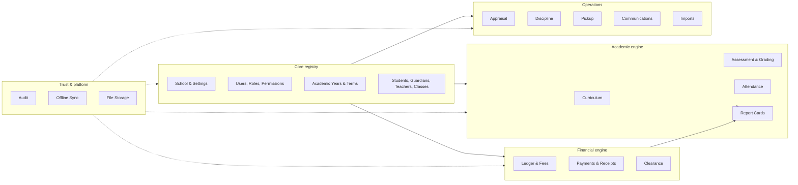
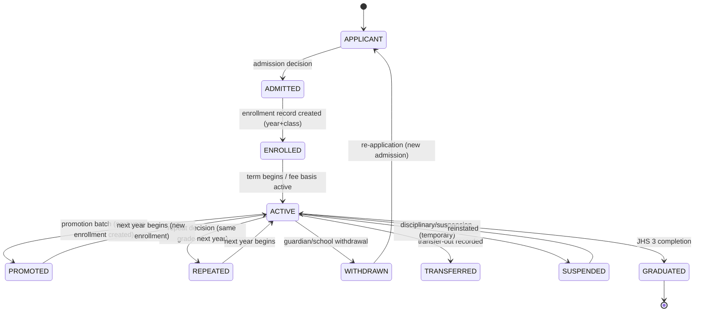
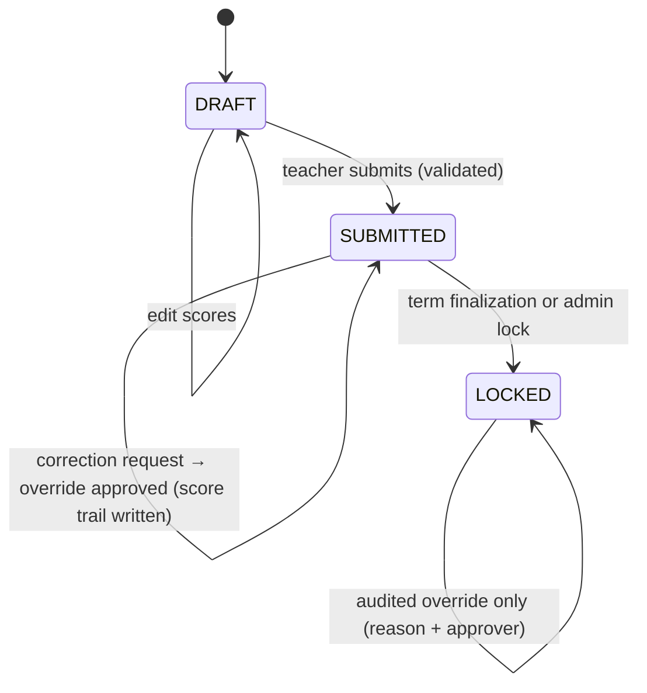
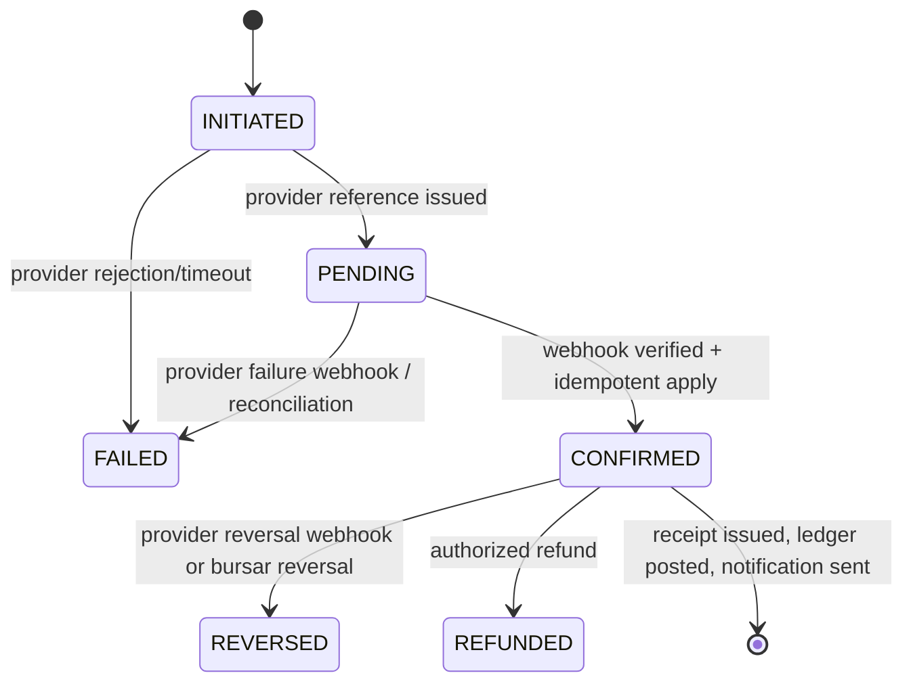
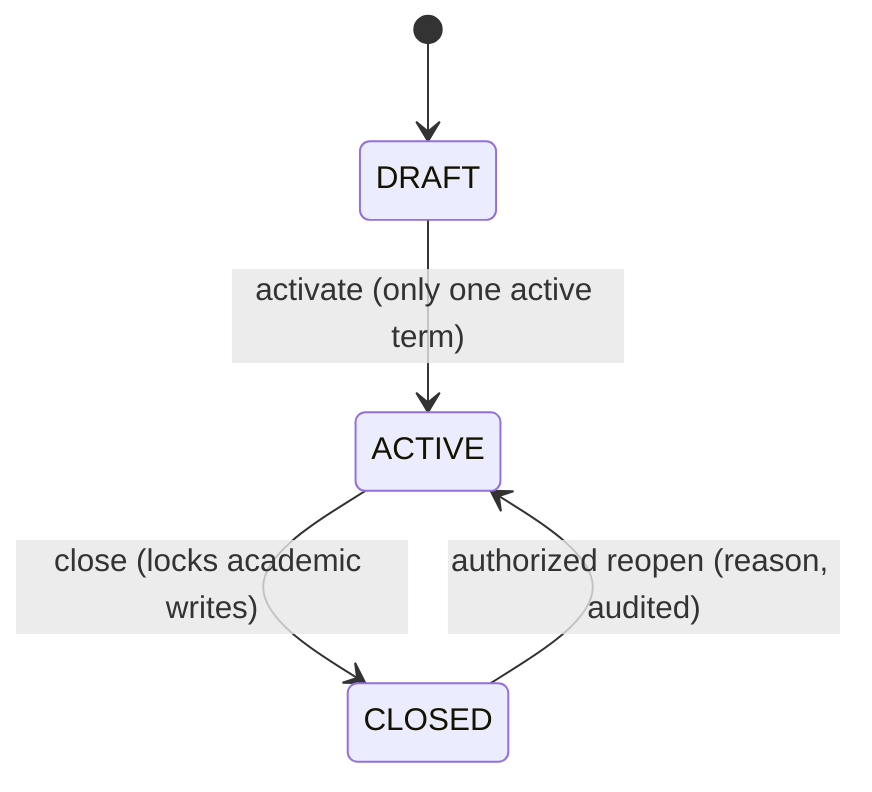
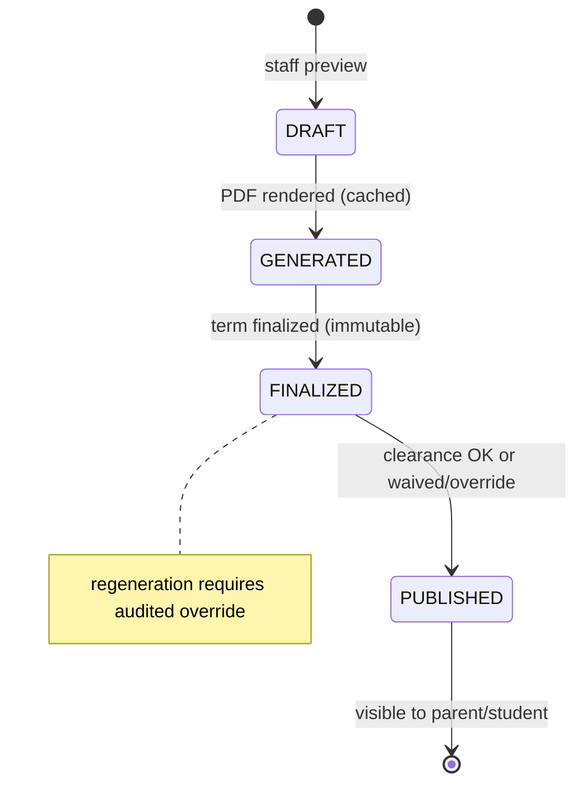
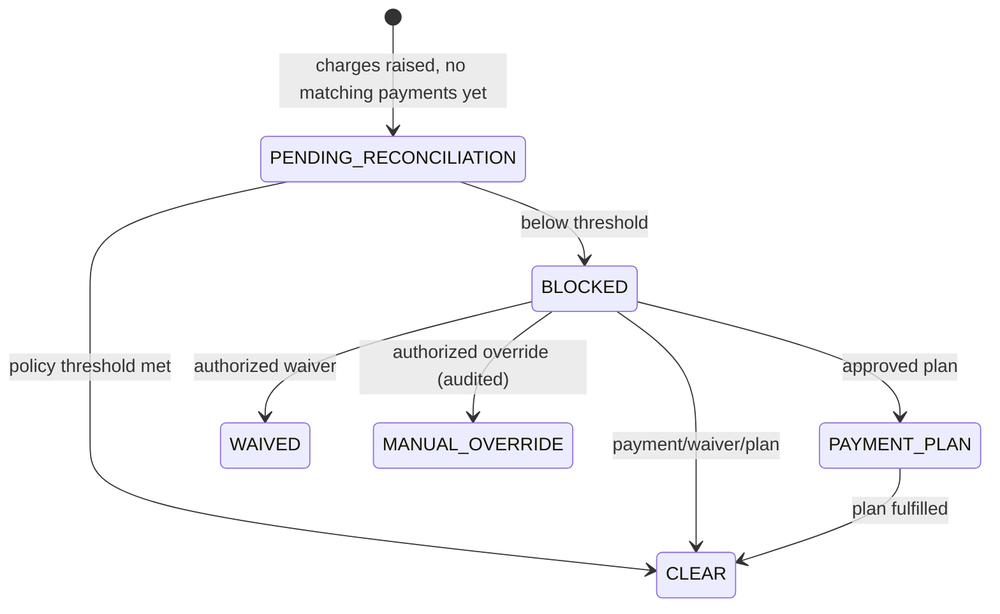

# 03 · Domain Model

**Status:** Draft for approval · **Covers:** deliverable item 6

## 1. Bounded contexts



---

## 2. Entity catalog

All entities from spec §3 are included (✅), plus additions (**＋**) with justification.
Common columns on nearly every table: `id UUIDv7 PK`, `school_id FK`, `created_at`,
`updated_at`, `created_by FK→users`, `updated_by` (§04 defines the convention).

### 2.1 Core registry

| Entity | Purpose & key attributes |
|---|---|
| ✅ School | Root tenant: name, short name, motto, logo/crest ref, location, Ghana Digital Address, contacts, timezone. |
| ✅ SchoolSetting | Key/value JSON settings per school (active year/term ids, rounding mode, position display, comms config…). Versioned via audit. |
| ✅ AcademicYear | name (`2026/2027`), start/end dates, `is_active`, status. |
| ✅ Term | belongs to year; name (Term 1/2/3), dates, status `DRAFT/ACTIVE/CLOSED`, reopen metadata. |
| ✅ Department | Optional section grouping (Early Childhood / Primary / JHS). |
| ✅ Grade | Level: code, display name, ordinal, band (`EARLY_CHILDHOOD/PRIMARY/JHS`), department. |
| ✅ ClassStream | A grade instance in a year: `(grade_id, academic_year_id)` + section letter/name, capacity, form teacher via assignment. |
| ✅ Student | admission code, surname/other names, gender, DOB, status, photo ref, nationality, religion (optional), medical notes (restricted), joined year. |
| ✅ ParentGuardian | name, phone(s), email, occupation, residential address, **ghana_digital_address**, **latitude/longitude (separate)**, comms preferences, contact windows, opt-outs. |
| ✅ ParentStudentRelationship | `(parent_id, student_id, relationship_type, is_primary_contact, is_billing_contact, effective_from/to)`. |
| ✅ Teacher | staff code, name, gender, DOB, contacts, qualification, employment info (role title, hired_on, status), user link. |
| ✅ TeacherAssignment | `(teacher_id, academic_year_id, class_stream_id, subject_id?, role: SUBJECT_TEACHER/FORM_TEACHER, is_active)` — drives all access. |
| ✅ User | Auth identity: unique username/email, password hash, status, last login, linked profile (teacher/parent/student, at most one each). |
| ✅ Role | Named role + description; system roles are fixed seeds, custom roles allowed. |
| ✅ Permission | Granular permission codes (fixed catalog, §06). |
| ＋ UserRole / RolePermission | M:N joins. |
| ✅ Enrollment | `(student_id, academic_year_id, class_stream_id, status, started_at, ended_at, is_repeat, promotion_source_id?)`. |
| ＋ PromotionBatch / PromotionDecision | End-of-year workflow containers (BR-S05). |
| ＋ DocumentSequence | Per-school counters for admission codes, receipt numbers, etc. |

### 2.2 Academic engine

| Entity | Purpose |
|---|---|
| ✅ Curriculum | Named curriculum (e.g., "NaCCA Basic School Curriculum"), owner school/national flag. |
| ✅ CurriculumVersion | Version tag, effective date, status `DRAFT/PUBLISHED/ARCHIVED`; immutable once published. |
| ✅ Subject | Code/name; per-curriculum naming allowed via CurriculumVersion link. |
| ＋ GradeSubject | Subjects offered at each grade. |
| ✅ Strand | `(curriculum_version_id, grade_id, subject_id, code, title)`. |
| ✅ SubStrand | Child of Strand. |
| ✅ ContentStandard | Child of SubStrand. |
| ✅ Indicator | Child of ContentStandard; learning indicator code (e.g., NaCCA-style codes). |
| ✅ CoreCompetency | Catalog (Critical Thinking, Creativity, Communication, Collaboration, Digital Literacy, Problem Solving, + configurable). |
| ＋ IndicatorCoreCompetency | M:N indicator↔competency. |
| ＋ CompetencyRating | Per student/term/competency qualitative rating + comment. |
| ＋ AssessmentScheme | Config per `(academic_year_id, term_id, grade_id, subject_id?)` — which components & weights apply. |
| ＋ AssessmentSchemeComponent | `(scheme_id, code, name, weight_pct, max_score, kind: CLASS/EXAM)`; weights sum = 100 per scheme. |
| ✅ Assessment | A concrete sheet: `(term_id, class_stream_id, subject_id, scheme_component_id, title, status DRAFT/SUBMITTED/LOCKED, submitted_by/at, locked_by/at)`. |
| ✅ AssessmentComponent | Spec's component concept realized as `AssessmentSchemeComponent` (config) — see note below. |
| ✅ AssessmentScore | `(assessment_id, enrollment_id, raw_score, is_absent, version)` + override trail (BR-M04). |
| ＋ ScoreOverride | Original score, new score, reason, requested_by, approved_by, timestamps. |
| ＋ DevelopmentalDomain | Configurable ECD domains. |
| ＋ DevelopmentalRating | `(student_id, term_id, domain_id, rating, comment, assessed_by)`. |
| ＋ ObservationLog | ECD daily logs (append-only, revisioned). |
| ✅ GradeScale | Named scale with scope (band/grade/year). |
| ＋ GradeScaleBand | `(scale_id, min_score, max_score, code, remark, rank)`. |
| ＋ BeceStyleResult | `(student_id, kind: SCHOOL_EXAM/MOCK/PREDICTION/OFFICIAL, subject, grade/score, label, recorded_by)` — BR-M09 labelling enforced at render time. |
| ✅ AttendanceRecord | Per student/day status (+note). |
| ＋ AttendanceSheet | Per class/day container: date, class, term, taken_by, status, submitted_at (enables compliance). |
| ✅ ReportCard | `(student_id, term_id, status DRAFT/GENERATED/FINALIZED/PUBLISHED, template_id, clearance_snapshot JSON, pdf_file_ref, finalized_by/at, published_at)`. |
| ✅ ReportTemplate | `(band, name, layout_config JSON, logo/signature refs, version, is_default)`. |

> Note on **AssessmentComponent**: the spec lists it as an entity; we realize it as
> `AssessmentSchemeComponent` (a configurable component definition attached to schemes),
> which both stores structure and keeps weights configurable (REQ-ASM-03). The name
> `assessment_components` is used in the schema to stay literal to the spec.

### 2.3 Financial engine

| Entity | Purpose |
|---|---|
| ✅ FeeStructure | `(academic_year_id, name, grade or band scope, status)` header for a set of fee items. |
| ＋ FeeStructureItem | `(structure_id, fee_type, display_name, amount_pesewas, period: PER_TERM/PER_YEAR/ONE_OFF, term_id?)`. |
| ✅ FeeCharge | A concrete charge on a student: `(enrollment_id, academic_year_id, term_id, fee_type, amount_pesewas, due_date, status ACTIVE/SETTLED/PART_SETTLED/ADJUSTED, source: STRUCTURE/MANUAL/OPENING)`. |
| ＋ Waiver | `(charge_id or enrollment scope, amount or pct, reason, approved_by)` → emits WAIVER credit. |
| ＋ PaymentPlan | `(student_id, term_id, status, approved_by)` + installments child rows. |
| ✅ Payment | `(student_id, payer_ref, amount_pesewas, method, provider, provider_reference, status INITIATED/PENDING/CONFIRMED/FAILED/REVERSED/REFUNDED, initiated_by, confirmed_at, receipt_id?)`. |
| ✅ PaymentAllocation | `(payment_id, fee_charge_id, amount_pesewas)`. |
| ＋ Adjustment | Typed charge/credit adjustments with reason (covers "Adjustment" entity). |
| ＋ Refund | Authorized refund record → REFUND credit entry. |
| ＋ LedgerEntry | The ledger: append-only, covers Credit & Debit concepts (`entry_type`), categories CHARGE/PAYMENT/WAIVER/ADJUSTMENT/REFUND/CREDIT_NOTE/OPENING_BALANCE/REVERSAL. |
| ✅ Receipt | `(receipt_no, payment_id, student snapshot, amount, method, date, tx_ref, year/term, balance_after_pesewas, status ISSUED/VOIDED, voided_by/at/reason)`. |
| ✅ FinancialClearance | Computed + override state per student/term/type (REPORT_CARD/EXAMINATION). |
| ＋ ClearancePolicy | Configurable thresholds (mode PERCENT/FIXED, value, scope band/grade). |
| ＋ PaymentProviderConfig | Provider registry (code, kind STUB/LIVE, webhook secret ref). |
| ＋ WebhookEvent | Raw inbound webhook storage, verification result, idempotency status. |

### 2.4 Operations

| Entity | Purpose |
|---|---|
| ✅ TeacherAppraisal | `(teacher_id, evaluator_user_id, period_from/to, status DRAFT/SUBMITTED/ACKNOWLEDGED, overall_rating)`. |
| ✅ AppraisalCriterion | Configurable criteria catalog (weights, max scores). |
| ＋ AppraisalScore | Per appraisal/criterion score + comment. |
| ✅ DisciplineIncident | `(student_id, incident_at, category, description, action_taken, staff_user_id, status OPEN/UNDER_REVIEW/RESOLVED, resolution, parent_notified_at)`. |
| ✅ PickupAuthorization | Per student person record + expiry + photo ref + status. |
| ✅ Notification | In-app notice `(recipient_user_id, kind, title, body, read_at, link)`. |
| ✅ SMSMessage | Outbound SMS record: recipient, normalized phone, provider, template, status, provider message id, sent_at, error. |
| ＋ CommunicationTemplate | Event-type → channel + template body (variables). |
| ✅ ImportJob | `(kind: STUDENTS/TEACHERS/PARENTS, file_ref, stage UPLOADED/PARSED/VALIDATED/PREVIEWED/CONFIRMED/IMPORTING/COMPLETED/FAILED/ROLLED_BACK, counts, actor)`. |
| ✅ ImportError | `(job_id, row_no, field, severity ERROR/WARNING/DUPLICATE/MATCH, message, guidance, raw_row JSON)`. |
| ✅ AuditLog | Append-only event store (§12 doc). |
| ＋ Session | Server-side session rows (revocable). |
| ＋ PasswordResetToken | Single-use, hashed, expiring. |
| ＋ SyncMutation | Offline idempotency ledger (`client_mutation_id` unique) (§09 doc). |
| ＋ StoredFile | File storage registry (key, purpose, mime, size, uploaded_by) — DB stores metadata only. |

---

## 3. Key relationships (cardinality)

- School 1—N {AcademicYear, Department, Grade, User, Role, …} (all scoped)
- AcademicYear 1—N Term; AcademicYear 1—N ClassStream (via Grade: Grade 1—N ClassStream)
- Grade N—1 Department (optional); Grade M—N Subject (via GradeSubject)
- Student 1—N Enrollment (one per year active); Enrollment N—1 ClassStream
- Student M—N ParentGuardian (via ParentStudentRelationship)
- Teacher 1—1 User (optional); Teacher 1—N TeacherAssignment; Assignment N—1 ClassStream, N—1 Subject (nullable for FORM_TEACHER)
- CurriculumVersion 1—N Strand 1—N SubStrand 1—N ContentStandard 1—N Indicator; Indicator M—N CoreCompetency
- AssessmentScheme 1—N AssessmentSchemeComponent; Assessment N—1 AssessmentSchemeComponent; AssessmentScore N—1 Assessment, N—1 Enrollment
- FeeStructure 1—N FeeStructureItem → billing run → FeeCharge (per enrollment)
- FeeCharge 1—N PaymentAllocation N—1 Payment; Payment 1—1 Receipt
- LedgerEntry N—1 Student; optional refs → FeeCharge / Payment / Waiver / Refund / reversed LedgerEntry
- ReportCard N—1 (Student, Term, ReportTemplate)

---

## 4. Lifecycles & state transitions

### 4.1 Student lifecycle (REQ-STU-01)



### 4.2 Mark sheet workflow (REQ-MRK-02, BR-M03/04)



### 4.3 Payment workflow (REQ-PAY-02)



### 4.4 Import job (REQ-IMP-04)

```mermaid
stateDiagram-v2
    [*] --> UPLOADED --> PARSED --> VALIDATED --> PREVIEWED --> CONFIRMED --> IMPORTING --> COMPLETED
    PARSED --> FAILED : unreadable file
    VALIDATED --> FAILED : fatal schema errors
    CONFIRMED --> ROLLED_BACK : transaction failure during import
    COMPLETED --> [*]
```

### 4.5 Term lifecycle (REQ-CAL-04)



### 4.6 Report card lifecycle (REQ-RPT-01..05)



### 4.7 Financial clearance (REQ-CLR-01)



### 4.8 Notification/SMS delivery

```mermaid
stateDiagram-v2
    [*] --> QUEUED --> SENDING --> DELIVERED
    SENDING --> FAILED : provider error (retry ×3 then FAILED)
    QUEUED --> SKIPPED : invalid number / opted out
```
