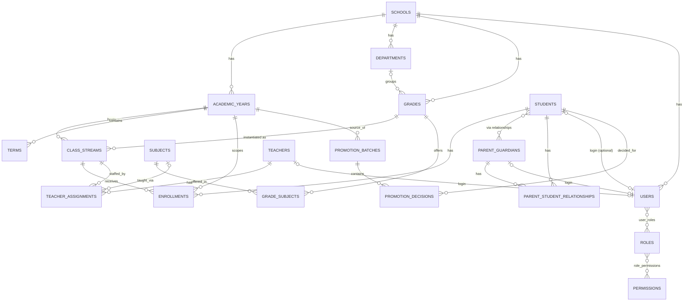
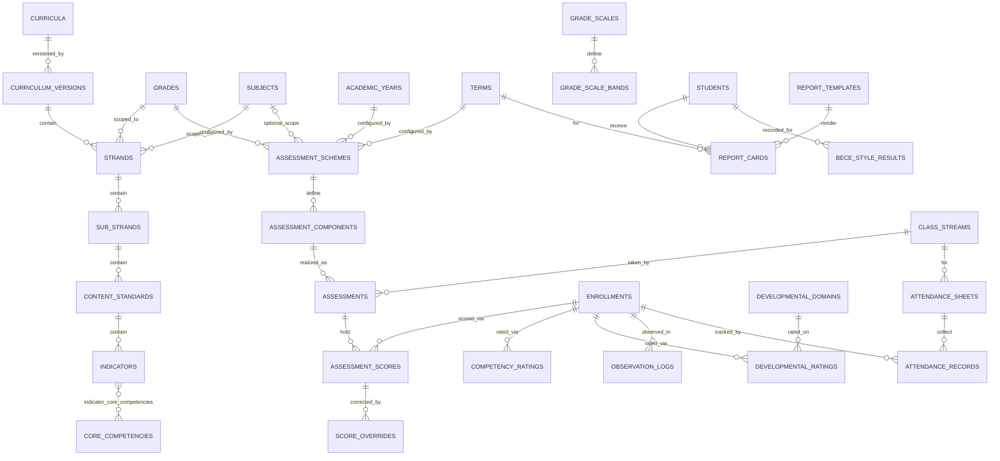
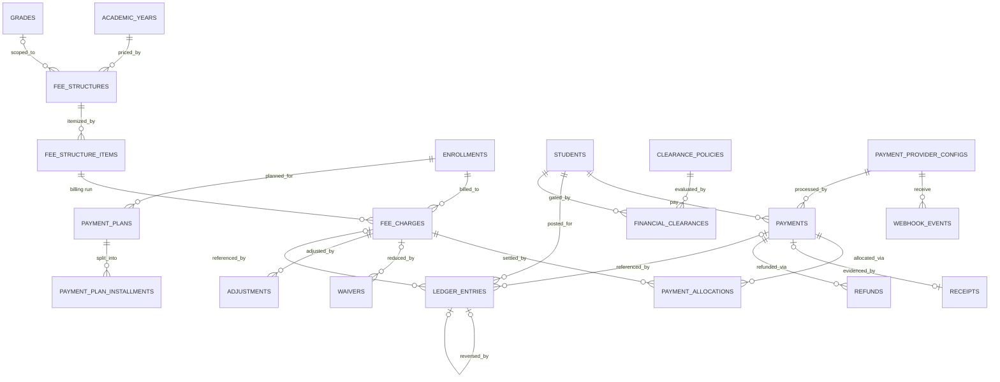
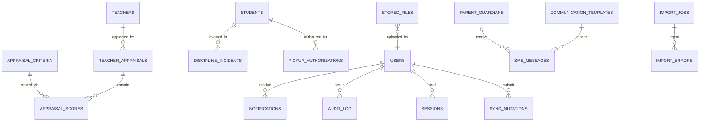

# 04 · ERD, Database Schema Proposal, Migrations & Seed Strategy

**Status:** Draft for approval · **Covers:** deliverable items 7–8 · **DB:** PostgreSQL 16

---

## 1. Conventions

| Convention | Rule |
|---|---|
| Primary keys | `id UUID` (UUIDv7 generated app-side; time-sortable, unenumerable — REQ-PRV-02). |
| Tenancy | `school_id UUID NOT NULL REFERENCES schools(id)` on every school-scoped table; all queries filter by it (repository layer enforces). |
| Timestamps | `created_at`, `updated_at` `timestamptz` (UTC). Business dates rendered in `Africa/Accra`. |
| Actor cols | `created_by`, `updated_by UUID REFERENCES users(id)` where write-operations are user-driven. |
| Money | `BIGINT` pesewas, `CHECK (amount_pesewas >= 0)` on documents; ledger sign via `entry_type`. |
| Enum-ish columns | `VARCHAR(32)` + `CHECK (col IN (...))` (portable, Alembic-friendly). |
| Naming | snake_case tables/columns; singular table names; `*_at` timestamps, `*_on` dates, `*_pesewas` money. |
| Soft delete | Not used for anything financial/academic. Registry rows (e.g., subjects) use `is_active` flags instead. |
| JSON | `JSONB` only for semi-structured config/snapshots (settings, template layout, report clearance snapshot, import raw rows). |

---

## 2. ERD (context diagrams)

### 2.1 Core registry

### 2.2 Academic engine

### 2.3 Financial engine

### 2.4 Operations & trust

---

## 3. Schema proposal (table definitions)

> Format: *purpose* → columns (type/constraints) → **U**nique / **IX** indexes / **CK** checks.
> Common cols (`id`, `school_id`, `created_at`, `updated_at`, `created_by`, `updated_by`) omitted for brevity unless notable.

### 3.1 Core registry

**schools** — tenant root. `name TEXT NOT NULL`, `short_name`, `motto TEXT`, `logo_file_id UUID→stored_files`, `location TEXT`, `ghana_digital_address TEXT`, `phone TEXT`, `email TEXT`, `timezone TEXT DEFAULT 'Africa/Accra'`, `settings JSONB DEFAULT '{}'`. U(name) per registration context.

**school_settings** — versioned key/value config (REQ-SET-01). `key TEXT NOT NULL`, `value JSONB NOT NULL`, `description TEXT`. U(school_id,key). IX(key). *(Changes audited; see BR-U06.)*

**academic_years** — `name TEXT NOT NULL` (e.g., `2026/2027`), `starts_on DATE NOT NULL`, `ends_on DATE NOT NULL`, `status VARCHAR(16) IN ('DRAFT','ACTIVE','ARCHIVED')`. U(school_id,name). CK(starts_on<ends_on). Partial U: one `status='ACTIVE'` per school.

**terms** — `academic_year_id FK NOT NULL`, `name TEXT NOT NULL`, `starts_on/ends_on DATE`, `status VARCHAR(16) IN ('DRAFT','ACTIVE','CLOSED')`, `closed_at`, `closed_by`, `reopened_at`, `reopened_by`, `reopen_reason TEXT`. U(academic_year_id,name). CK(dates ordered; no overlap enforced via service + exclusion constraint on `(academic_year_id)` daterange). Partial U: one ACTIVE term per school.

**departments** — `name TEXT NOT NULL`, `code TEXT`. U(school_id,code).

**grades** — `department_id FK`, `code TEXT NOT NULL` (`CRECHE`,`NUR1`,…,`B4`,…,`JHS3`), `name TEXT NOT NULL`, `ordinal INT NOT NULL`, `band VARCHAR(16) IN ('EARLY_CHILDHOOD','PRIMARY','JHS')`. U(school_id,code). IX(band,ordinal).

**class_streams** — `grade_id FK NOT NULL`, `academic_year_id FK NOT NULL`, `name TEXT NOT NULL` (`Basic 4A`), `section_label TEXT` (`A`), `capacity INT`. U(grade_id,academic_year_id,section_label). IX(academic_year_id).

**subjects** — `code TEXT NOT NULL`, `name TEXT NOT NULL`, `is_active BOOL DEFAULT true`. U(school_id,code).

**grade_subjects** — `grade_id FK`, `subject_id FK`. U(grade_id,subject_id).

**students** — `admission_code TEXT NOT NULL` (display ID; from sequence), `surname TEXT NOT NULL`, `other_names TEXT NOT NULL`, `gender VARCHAR(8) IN ('F','M')`, `date_of_birth DATE NOT NULL`, `photo_file_id UUID`, `nationality TEXT DEFAULT 'Ghanaian'`, `religion TEXT`, `medical_notes TEXT` (restricted), `status VARCHAR(16) IN ('APPLICANT','ADMITTED','ENROLLED','ACTIVE','PROMOTED','REPEATED','WITHDRAWN','TRANSFERRED','SUSPENDED','GRADUATED')`, `admitted_on DATE`. U(school_id,admission_code). IX(status), IX(surname,other_names), IX(date_of_birth).

**parent_guardians** — `name TEXT NOT NULL`, `phone TEXT NOT NULL` (E.164 +233), `phone2 TEXT`, `email TEXT`, `occupation TEXT`, `residential_address TEXT`, `ghana_digital_address TEXT` (**distinct field**, REQ-PAR-02), `latitude NUMERIC(9,6)`, `longitude NUMERIC(9,6)`, `comm_preferences JSONB` (`channels`, `preferred_windows`, `language`), `sms_opt_out BOOL DEFAULT false`, `photo_file_id UUID`. IX(phone), IX(name). CK(phone matches `^\+233\d{9}$`).

**parent_student_relationships** — `parent_id FK`, `student_id FK`, `relationship_type VARCHAR(16) IN ('MOTHER','FATHER','GUARDIAN','GRANDPARENT','SIBLING','OTHER')`, `is_primary_contact BOOL`, `is_billing_contact BOOL`, `source VARCHAR(24) IN ('MANUAL','IMPORT','IMPORT_SUGGESTION')`, `confirmed_by FK users`, `effective_from DATE`, `effective_to DATE`. U(parent_id,student_id,relationship_type). IX(student_id).

**teachers** — `staff_code TEXT`, `user_id FK UNIQUE` (nullable), `surname/other_names`, `gender`, `date_of_birth`, `phone`, `email`, `qualification TEXT`, `job_title TEXT`, `hired_on DATE`, `employment_status VARCHAR(16) IN ('ACTIVE','ON_LEAVE','EXITED')`. U(school_id,staff_code), U(user_id).

**teacher_assignments** — `teacher_id FK`, `academic_year_id FK`, `class_stream_id FK`, `subject_id FK NULL`, `role VARCHAR(24) IN ('SUBJECT_TEACHER','FORM_TEACHER')`, `is_active BOOL DEFAULT true`. U(teacher_id,academic_year_id,class_stream_id,subject_id) NULLS NOT DISTINCT. IX(class_stream_id,subject_id) — drives mark/attendance access (REQ-MRK-01).

**users** — `username TEXT NOT NULL`, `email TEXT`, `password_hash TEXT NOT NULL`, `display_name`, `status VARCHAR(16) IN ('ACTIVE','LOCKED','DEACTIVATED')`, `failed_login_count INT DEFAULT 0`, `locked_until TIMESTAMPTZ`, `last_login_at`, `teacher_id FK UNIQUE NULL`, `parent_id FK UNIQUE NULL`, `student_id FK UNIQUE NULL`. U(username), U(email) where present. IX(status).

**roles** — `code TEXT NOT NULL` (`SUPER_ADMIN`,`HEAD_TEACHER`,`BURSAR`,`TEACHER`,`PARENT`,`STUDENT`, custom…), `name`, `is_system BOOL`. U(school_id,code).

**permissions** — global catalog (no school_id): `code TEXT PK` (`VIEW_STUDENT`, … §06), `name`, `description`.

**role_permissions** — `role_id FK`, `permission_code FK`. U(role_id,permission_code).

**user_roles** — `user_id FK`, `role_id FK`, `granted_by FK`, `granted_at`. U(user_id,role_id).

**enrollments** — `student_id FK NOT NULL`, `academic_year_id FK NOT NULL`, `class_stream_id FK NOT NULL`, `status VARCHAR(16) IN ('ACTIVE','COMPLETED','WITHDRAWN','TRANSFERRED')`, `started_on DATE`, `ended_on DATE`, `is_repeat BOOL DEFAULT false`, `promotion_decision_id FK NULL`. Partial U(student_id,academic_year_id) WHERE status='ACTIVE'. IX(class_stream_id,academic_year_id).

**promotion_batches** — `from_academic_year_id FK`, `to_academic_year_id FK`, `status VARCHAR(16) IN ('DRAFT','PENDING_DECISION','APPLIED','REVERSED')`, `applied_by`, `applied_at`. U(from,to).

**promotion_decisions** — `batch_id FK`, `student_id FK`, `from_enrollment_id FK`, `to_class_stream_id FK NULL`, `decision VARCHAR(16) IN ('PROMOTE','REPEAT','WITHDRAW','TRANSFER','GRADUATE')`, `note TEXT`. U(batch_id,student_id).

**document_sequences** — `key TEXT` (`ADMISSION_CODE`,`RECEIPT_NO`,`STAFF_CODE`), `current_value BIGINT NOT NULL DEFAULT 0`, `prefix TEXT`. U(school_id,key). Rows locked `FOR UPDATE` on next-value.

### 3.2 Academic engine

**curricula** — `name TEXT NOT NULL`, `origin VARCHAR(16) IN ('NATIONAL','SCHOOL')`, `description`. U(school_id,name).

**curriculum_versions** — `curriculum_id FK`, `version_label TEXT NOT NULL` (`2026.v1`), `effective_on DATE`, `status VARCHAR(16) IN ('DRAFT','PUBLISHED','ARCHIVED')`, `published_at`. U(curriculum_id,version_label). CK: published versions immutable (enforced in service; no UPDATE path in repository).

**strands** — `curriculum_version_id FK`, `grade_id FK`, `subject_id FK`, `code TEXT`, `title TEXT NOT NULL`, `ordinal INT`. U(curriculum_version_id,grade_id,subject_id,code).

**sub_strands** — `strand_id FK`, `code`, `title`, `ordinal`. U(strand_id,code).

**content_standards** — `sub_strand_id FK`, `code`, `title`, `ordinal`. U(sub_strand_id,code).

**indicators** — `content_standard_id FK`, `code TEXT NOT NULL` (NaCCA-style indicator code), `title TEXT NOT NULL`, `ordinal INT`. U(content_standard_id,code). IX(code).

**core_competencies** — `code TEXT` (`CRITICAL_THINKING`,`CREATIVITY`,`COMMUNICATION`,`COLLABORATION`,`DIGITAL_LITERACY`,`PROBLEM_SOLVING`, custom), `name`, `description`. U(school_id,code).

**indicator_core_competencies** — `indicator_id FK`, `competency_id FK`. U(indicator_id,competency_id).

**competency_ratings** — `enrollment_id FK`, `term_id FK`, `competency_id FK`, `rating VARCHAR(16) IN ('EMERGING','DEVELOPING','ACHIEVED')` (configurable via settings), `comment TEXT`, `assessed_by FK users`. U(enrollment_id,term_id,competency_id).

**assessment_schemes** — `academic_year_id FK`, `term_id FK`, `grade_id FK`, `subject_id FK NULL` (null = all subjects of grade), `name TEXT`. U(academic_year_id,term_id,grade_id,subject_id) NULLS NOT DISTINCT. Most-specific scheme wins (service rule).

**assessment_components** — `scheme_id FK`, `code TEXT` (`CLASS_SCORE`,`TERMINAL_EXAM`, custom), `name TEXT`, `kind VARCHAR(16) IN ('CLASS','EXAM')`, `weight_pct NUMERIC(5,2) NOT NULL`, `max_score NUMERIC(6,2) NOT NULL DEFAULT 100`, `ordinal INT`. CK(weight_pct>0, max_score>0). Per-scheme CK: Σweight_pct = 100 (service + DB assertion trigger).

**assessments** — `term_id FK`, `class_stream_id FK`, `subject_id FK`, `component_id FK`, `title TEXT`, `status VARCHAR(16) IN ('DRAFT','SUBMITTED','LOCKED')`, `submitted_by/at`, `locked_by/at`, `version INT DEFAULT 1` (optimistic concurrency). IX(class_stream_id,subject_id,term_id), IX(status).

**assessment_scores** — `assessment_id FK`, `enrollment_id FK`, `raw_score NUMERIC(6,2)`, `is_absent BOOL DEFAULT false`, `note TEXT`, `version INT DEFAULT 1`. U(assessment_id,enrollment_id). CK(raw_score BETWEEN 0 AND component.max_score — validated in service referencing component). IX(enrollment_id).

**score_overrides** — `assessment_score_id FK`, `original_score NUMERIC(6,2) NOT NULL`, `new_score NUMERIC(6,2) NOT NULL`, `reason TEXT NOT NULL`, `requested_by FK users NOT NULL`, `approved_by FK users NOT NULL`, `approved_at TIMESTAMPTZ NOT NULL`. IX(assessment_score_id). *(Append-only; original row also retained via audit.)*

**developmental_domains** — `code TEXT` (`GROSS_MOTOR`,…), `name`, `ordinal`, `is_active`. U(school_id,code).

**developmental_ratings** — `enrollment_id FK`, `term_id FK`, `domain_id FK`, `rating VARCHAR(16) IN ('EMERGING','DEVELOPING','ACHIEVED')`, `comment`, `assessed_by`. U(enrollment_id,term_id,domain_id).

**observation_logs** — `enrollment_id FK`, `logged_on DATE NOT NULL`, `author_user_id FK NOT NULL`, `body TEXT NOT NULL`, `superseded_by FK observation_logs NULL` (revision chain, BR-E02). IX(enrollment_id,logged_on).

**grade_scales** — `name TEXT`, `scope_band VARCHAR(16) NULL`, `grade_id FK NULL`, `academic_year_id FK NULL`, `is_default BOOL`. IX(scope). Most-specific scale wins.

**grade_scale_bands** — `scale_id FK`, `min_score NUMERIC(6,2)`, `max_score NUMERIC(6,2)`, `code TEXT` (`A`,`B`,…/`1`..`9`), `remark TEXT`, `rank INT`. CK(min<=max). Per-scale non-overlap enforced by exclusion constraint on `numrange(min,max)` (inclusive handling defined in service).

**bece_style_results** — `student_id FK`, `kind VARCHAR(16) IN ('SCHOOL_EXAM','MOCK','PREDICTION','OFFICIAL')`, `subject_name TEXT`, `score NUMERIC(6,2) NULL`, `grade_code TEXT NULL`, `sat_on DATE`, `label TEXT` (mandatory display label for non-OFFICIAL), `recorded_by`. IX(student_id,kind). CK: kind!='OFFICIAL' ⇒ label NOT NULL (service-enforced).

**attendance_sheets** — `class_stream_id FK`, `term_id FK`, `sheet_date DATE NOT NULL`, `taken_by FK users`, `status VARCHAR(16) IN ('DRAFT','SUBMITTED')`, `submitted_at`. U(class_stream_id,sheet_date). IX(term_id,sheet_date) (compliance queries).

**attendance_records** — `sheet_id FK`, `enrollment_id FK`, `status VARCHAR(16) IN ('PRESENT','ABSENT','LATE','EXCUSED','LEFT_EARLY')`, `note TEXT`. U(sheet_id,enrollment_id). IX(enrollment_id).

**report_templates** — `band VARCHAR(16) IN ('EARLY_CHILDHOOD','PRIMARY','JHS')`, `name TEXT`, `version INT`, `layout_config JSONB NOT NULL` (sections, columns, show_positions, indicator_mode, remark blocks), `logo_file_id`, `head_signature_file_id`, `is_default BOOL`. U(school_id,band,version).

**report_cards** — `student_id FK`, `term_id FK`, `template_id FK`, `status VARCHAR(16) IN ('DRAFT','GENERATED','FINALIZED','PUBLISHED')`, `clearance_snapshot JSONB`, `data_snapshot JSONB` (scores/attendance used at finalization → immutability), `pdf_file_id FK stored_files`, `finalized_by/at`, `published_at`, `override_reason TEXT NULL`. U(student_id,term_id). IX(status), IX(term_id).

### 3.3 Financial engine

**fee_structures** — `academic_year_id FK`, `name TEXT`, `grade_id FK NULL`, `band VARCHAR(16) NULL` (grade wins over band when both candidates match), `status VARCHAR(16) IN ('DRAFT','ACTIVE','ARCHIVED')`. IX(academic_year_id).

**fee_structure_items** — `structure_id FK`, `fee_type VARCHAR(24) IN ('TUITION','FEEDING','ICT_LAB','PTA_LEVY','TRANSPORT','EXAMINATION','OTHER')`, `display_name TEXT`, `amount_pesewas BIGINT NOT NULL`, `period VARCHAR(16) IN ('PER_TERM','PER_YEAR','ONE_OFF')`, `term_id FK NULL`. CK(amount>=0).

**fee_charges** — `enrollment_id FK`, `academic_year_id FK`, `term_id FK NULL` (null for annual/one-off), `fee_type VARCHAR(24)`, `display_name TEXT`, `amount_pesewas BIGINT`, `due_on DATE`, `status VARCHAR(16) IN ('ACTIVE','PART_SETTLED','SETTLED','ADJUSTED')`, `source VARCHAR(16) IN ('STRUCTURE','MANUAL','OPENING')`. IX(enrollment_id,status), IX(due_on). CK(amount>0).

**waivers** — `fee_charge_id FK NULL`, `enrollment_id FK`, `term_id FK`, `kind VARCHAR(16) IN ('WAIVER','DISCOUNT','SCHOLARSHIP')`, `amount_pesewas BIGINT NULL`, `pct NUMERIC(5,2) NULL`, `reason TEXT NOT NULL`, `approved_by FK users NOT NULL`. CK(exactly one of amount/pct). Emits ledger credit.

**payment_plans** — `student_id FK`, `term_id FK`, `status VARCHAR(16) IN ('PROPOSED','APPROVED','ON_TRACK','DEFAULTED','COMPLETED')`, `approved_by`, `note`. IX(student_id,term_id).

**payment_plan_installments** — `plan_id FK`, `due_on DATE`, `amount_pesewas BIGINT`, `status VARCHAR(16) IN ('PENDING','PAID','MISSED')`.

**payments** — `student_id FK`, `term_id FK NULL`, `amount_pesewas BIGINT`, `method VARCHAR(24) IN ('MTN_MOMO','TELECEL_CASH','AT_MONEY','CASH','BANK_TRANSFER','OTHER')`, `provider_code TEXT` (→payment_provider_configs), `provider_reference TEXT`, `payer_name TEXT`, `payer_phone TEXT`, `status VARCHAR(16) IN ('INITIATED','PENDING','CONFIRMED','FAILED','REVERSED','REFUNDED')`, `failure_reason TEXT`, `initiated_by FK users`, `confirmed_at`, `receipt_id FK NULL`. U(provider_code,provider_reference) WHERE confirmed-ish (idempotency, REQ-PAY-03). IX(student_id,status), IX(status,created_at) (bursar queues). CK(amount>0).

**payment_allocations** — `payment_id FK`, `fee_charge_id FK`, `amount_pesewas BIGINT`. CK(amount>0). CK(Σ allocations ≤ payment amount — service enforced). IX(fee_charge_id).

**adjustments** — `fee_charge_id FK NULL`, `enrollment_id FK`, `direction VARCHAR(8) IN ('DEBIT','CREDIT')`, `amount_pesewas BIGINT`, `reason TEXT NOT NULL`, `approved_by FK users`. Emits ledger entry.

**refunds** — `payment_id FK`, `amount_pesewas BIGINT`, `reason TEXT NOT NULL`, `authorized_by FK users NOT NULL`, `status VARCHAR(16) IN ('REQUESTED','APPROVED','PAID','REJECTED')`. Emits ledger credit on APPROVED→PAID.

**ledger_entries** — the source of financial truth (REQ-FIN-01). `student_id FK NOT NULL`, `academic_year_id FK NOT NULL`, `term_id FK NULL`, `entry_type VARCHAR(8) IN ('DEBIT','CREDIT')`, `category VARCHAR(24) IN ('CHARGE','PAYMENT','WAIVER','ADJUSTMENT','REFUND','CREDIT_NOTE','OPENING_BALANCE','REVERSAL')`, `amount_pesewas BIGINT NOT NULL`, `occurred_on DATE NOT NULL`, `description TEXT`, `fee_charge_id FK NULL`, `payment_id FK NULL`, `waiver_id FK NULL`, `adjustment_id FK NULL`, `refund_id FK NULL`, `reversed_entry_id FK ledger_entries NULL`, `idempotency_key TEXT NULL`, `posted_by FK users`. U(idempotency_key) WHERE NOT NULL (webhook dedupe). IX(student_id,academic_year_id,term_id,occurred_on) (balance queries). CK(amount>0; category='REVERSAL' ⇒ reversed_entry_id NOT NULL). **Append-only: no UPDATE/DELETE grants.** Balance view: `student_balances` (see below).

**student_balances** (view/materialized) — derived `Σ DEBIT − Σ CREDIT` per student (and per year/term rollups). Not updatable by app code; recomputed cheaply at 700-student scale; indexed materialization optional later.

**receipts** — `receipt_no TEXT NOT NULL` (sequence: `HSA-2026-000123`), `payment_id FK UNIQUE`, `student_id FK`, `payer_name TEXT`, `amount_pesewas BIGINT`, `method VARCHAR(24)`, `issued_on DATE`, `transaction_ref TEXT`, `academic_year_id FK`, `term_id FK NULL`, `balance_after_pesewas BIGINT NOT NULL`, `status VARCHAR(16) IN ('ISSUED','VOIDED')`, `voided_by/at/reason TEXT`. U(school_id,receipt_no). CK(balance_after>=0).

**clearance_policies** — `academic_year_id FK`, `term_id FK NULL` (null = all terms), `clearance_type VARCHAR(16) IN ('REPORT_CARD','EXAMINATION')`, `mode VARCHAR(16) IN ('PERCENT_OF_CHARGES','FIXED_AMOUNT')`, `threshold NUMERIC(12,2) NOT NULL` (percent 0–100 or pesewas), `band VARCHAR(16) NULL`, `grade_id FK NULL`. IX(academic_year_id,clearance_type).

**financial_clearances** — `student_id FK`, `academic_year_id FK`, `term_id FK`, `clearance_type VARCHAR(16)`, `state VARCHAR(24) IN ('CLEAR','BLOCKED','WAIVED','PAYMENT_PLAN','PENDING_RECONCILIATION','MANUAL_OVERRIDE')`, `computed_at`, `override_by FK NULL`, `override_reason TEXT`, `override_at`. U(student_id,academic_year_id,term_id,clearance_type). IX(state).

**payment_provider_configs** — `code TEXT` (`MTN_MOMO_STUB`,`HUBTEL_MOMO`,…), `display_name`, `kind VARCHAR(8) IN ('STUB','LIVE')`, `webhook_secret_env TEXT` (name of env var, **never the secret**), `config JSONB`. U(school_id,code).

**webhook_events** — `provider_code TEXT`, `external_event_id TEXT`, `payload JSONB`, `signature_status VARCHAR(16) IN ('VALID','INVALID','MISSING')`, `processed BOOL DEFAULT false`, `payment_id FK NULL`, `received_at`. U(provider_code,external_event_id) WHERE NOT NULL. IX(processed,received_at) (monitoring, REQ-OBS).

### 3.4 Operations

**appraisal_criteria** — `code TEXT` (`LESSON_PLAN_QUALITY`,…), `name`, `max_score INT`, `weight_pct NUMERIC(5,2)`, `is_active`. U(school_id,code).

**teacher_appraisals** — `teacher_id FK`, `evaluator_user_id FK`, `period_from DATE`, `period_to DATE`, `status VARCHAR(16) IN ('DRAFT','SUBMITTED','ACKNOWLEDGED')`, `overall_rating NUMERIC(5,2)`, `overall_comment TEXT`, `acknowledged_at`, `submitted_at`. IX(teacher_id), IX(period). Confidentiality: RBAC (REQ-APR-01).

**appraisal_scores** — `appraisal_id FK`, `criterion_id FK`, `score NUMERIC(6,2)`, `comment TEXT`. U(appraisal_id,criterion_id). CK(score between 0 and criterion.max_score).

**discipline_incidents** — `student_id FK`, `incident_at TIMESTAMPTZ NOT NULL`, `category TEXT NOT NULL`, `description TEXT NOT NULL`, `action_taken TEXT`, `staff_user_id FK NOT NULL`, `status VARCHAR(16) IN ('OPEN','UNDER_REVIEW','RESOLVED')`, `resolution TEXT`, `parent_notified_at TIMESTAMPTZ`, `severity VARCHAR(16) IN ('MINOR','MODERATE','SERIOUS')`. IX(student_id), IX(status). Restricted RBAC (REQ-DIS-01).

**pickup_authorizations** — `student_id FK`, `person_name TEXT NOT NULL`, `relationship TEXT`, `phone TEXT`, `photo_file_id FK NULL`, `id_reference TEXT`, `status VARCHAR(16) IN ('ACTIVE','REVOKED','EXPIRED')`, `valid_from DATE`, `expires_on DATE`, `revoked_by/at/reason`. IX(student_id,status). CK(expires_on>valid_from).

**notifications** — `recipient_user_id FK`, `kind VARCHAR(32)` (`PAYMENT_CONFIRMED`,`FEE_REMINDER`,`EMERGENCY_BROADCAST`,`REPORT_AVAILABLE`,`ANNOUNCEMENT`,…), `title TEXT`, `body TEXT`, `link TEXT`, `read_at TIMESTAMPTZ NULL`. IX(recipient_user_id,read_at).

**communication_templates** — `event_code TEXT`, `channel VARCHAR(8) IN ('SMS','IN_APP')`, `template TEXT` (variables `{{student_name}}`…), `is_active`. U(event_code,channel).

**sms_messages** — `recipient_guardian_id FK NULL`, `recipient_phone TEXT NOT NULL`, `template_id FK NULL`, `rendered_body TEXT NOT NULL`, `provider_code TEXT`, `status VARCHAR(16) IN ('QUEUED','SENDING','DELIVERED','FAILED','SKIPPED')`, `provider_message_id TEXT`, `attempts INT DEFAULT 0`, `error TEXT`, `sent_at`. U(provider_code,provider_message_id) WHERE NOT NULL. IX(status,created_at).

**import_jobs** — `kind VARCHAR(16) IN ('STUDENTS','TEACHERS','PARENTS')`, `file_id FK stored_files`, `stage VARCHAR(16) IN ('UPLOADED','PARSED','VALIDATED','PREVIEWED','CONFIRMED','IMPORTING','COMPLETED','FAILED','ROLLED_BACK')`, `options JSONB` (target year, opening-debt policy…), `rows_total/rows_ok/rows_failed/rows_warn/rows_dup INT`, `summary JSONB`, `started_at`, `finished_at`. IX(stage).

**import_errors** — `job_id FK`, `row_no INT`, `field TEXT`, `severity VARCHAR(16) IN ('ERROR','WARNING','DUPLICATE','MATCH_CANDIDATE')`, `message TEXT`, `guidance TEXT`, `raw_row JSONB`, `match_suggestion JSONB NULL` (parent link candidates w/ confidence). IX(job_id,severity).

**audit_log** — append-only (REQ-AUD-01). `actor_user_id FK NULL` (null=system), `action TEXT NOT NULL` (`GRADES_OVERRIDE`,`PAYMENT_VOID`,…), `entity_type TEXT NOT NULL`, `entity_id TEXT NOT NULL`, `previous JSONB`, `new JSONB`, `reason TEXT`, `ip INET`, `user_agent TEXT`, `occurred_at TIMESTAMPTZ DEFAULT now()`, `prev_hash TEXT`, `row_hash TEXT` (hash-chain option, §12). IX(entity_type,entity_id,occurred_at), IX(actor_user_id,occurred_at), IX(action). **No UPDATE/DELETE grants.** Partition by month (PostgreSQL declarative) once volume warrants.

### 3.5 Platform / trust

**sessions** — `user_id FK`, `token_hash TEXT NOT NULL` (server stores hash only), `ip INET`, `user_agent TEXT`, `created_at`, `expires_at`, `revoked_at`. U(token_hash). IX(user_id), IX(expires_at) (GC).

**password_reset_tokens** — `user_id FK`, `token_hash TEXT NOT NULL`, `expires_at TIMESTAMPTZ NOT NULL`, `used_at TIMESTAMPTZ NULL`, `purpose VARCHAR(16) IN ('RESET','RECOVERY')`. U(token_hash). CK(expires_at <= created_at + interval '1 hour').

**sync_mutations** — offline idempotency (§09). `client_mutation_id UUID NOT NULL`, `user_id FK`, `entity_type TEXT`, `entity_ref TEXT`, `payload JSONB`, `status VARCHAR(16) IN ('APPLIED','REJECTED','CONFLICT')`, `response JSONB`, `received_at`. U(client_mutation_id). IX(user_id,received_at).

**stored_files** — file registry (REQ-TECH-04). `storage_key TEXT NOT NULL` (object-store key), `purpose VARCHAR(32)` (`LOGO`,`STUDENT_PHOTO`,`REPORT_CARD`,`RECEIPT`,`IMPORT_FILE`,`SIGNATURE`,…), `mime TEXT`, `size_bytes BIGINT`, `checksum TEXT`. U(storage_key). IX(purpose).

---

## 4. Migration strategy (REQ-DB-01)

- **Tooling:** Alembic, one directory `backend/app/migrations`; `alembic upgrade head` in CI and deploy.
- **Baseline:** Phase 3 begins with `0001_core.sql`… generated from SQLAlchemy models (single source of truth = models).
- **Rules:** additive changes preferred; destructive changes require two-step (deprecate → drop) migrations; every migration ships with a tested downgrade where feasible; data migrations (e.g., seeding permission catalog) are idempotent.
- **CI:** fresh DB + `upgrade head` + full test suite on every PR.
- **Production:** migration runs in deploy pipeline with app in maintenance window (short; schema mostly additive).

## 5. Seed strategy (REQ-SEED-01/02)

- **Deterministic synthetic generator** (`backend/scripts/seed.py`, seeded RNG) using the `faker` library with a Ghanaian name pool; **100% fictional**, watermark setting `school.name = "Hope Star Academy (DEMO)"`.
- **Stages (idempotent, `--reset` drops & recreates):**
  1. Catalog: permissions, roles (+matrix), grades (14), departments, subjects per grade, domains, competencies, appraisal criteria, comm templates.
  2. School + settings + academic years (current `2026/2027` active, prior `2025/2026` historical with finalized data) + terms; grading scales; assessment schemes (Primary 50/50, JHS 30/70 as *config rows*); fee structures per spec §19 values; clearance policies.
  3. People: 30 teachers (+users), ~20 class streams across 14 grades, 700+ students, ~450 guardians with multi-child & multi-guardian links (phone-match import scenario fixtures included).
  4. Enrollments for current + prior year; prior-year promotion batch applied.
  5. Finance: opening balances subset, billing run for current term, mixed payment history (cash/MoMo/Telecel/AT incl. pending/failed/reversed), allocations, waivers, receipts; computed clearance states.
  6. Academics: prior year finalized assessments + report cards (published), current term draft/submitted marks, attendance (~92% weighted), ECD developmental ratings + observations, competency ratings.
  7. Ops: appraisals (prior year), discipline sample (restricted), pickup authorizations for EC students.
- **Dev defaults:** admin (`admin@demo`), bursar, head teacher, 3 teachers, 2 parents, 1 student login; credentials printed once, docs mark them demo-only.
