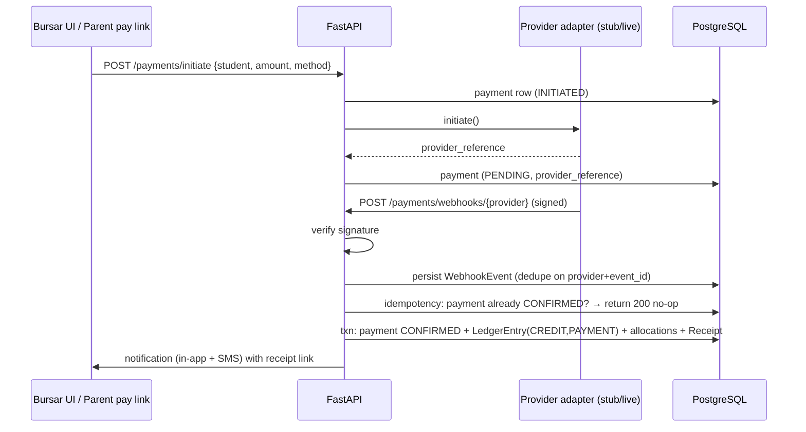

# 08 · Financial Ledger & Payment Architecture

**Status:** Draft for approval · **Covers:** deliverable items 14–15

---

## 1. Ledger architecture (REQ-FIN-01..08)

### 1.1 Principles
1. **`ledger_entries` is the single source of truth** — append-only, immutable (no UPDATE/DELETE DB grants; BR-F02).
2. **Balances are derived** (`student_balances` view): `Σ DEBIT − Σ CREDIT` per student, sliceable by year/term. There is **no `student.balance` column** anywhere.
3. Every entry references its business document (charge/payment/waiver/adjustment/refund) — full traceability both directions.
4. Errors are corrected by **reversing entries** (`category=REVERSAL`, `reversed_entry_id` set, reason mandatory, audited) — never by editing or deleting.
5. Money is integer **pesewas** (`BIGINT`), amounts positive; sign comes from `entry_type` (BR-F13).

### 1.2 Entry taxonomy

| entry_type | category | Created by | Effect on balance |
|---|---|---|---|
| DEBIT | CHARGE | billing run / manual charge | + |
| DEBIT | OPENING_BALANCE | import/setup (audited) | + |
| DEBIT | ADJUSTMENT | admin adjustment | + |
| CREDIT | PAYMENT | confirmed payment | − |
| CREDIT | WAIVER | approved waiver/discount/scholarship | − |
| CREDIT | ADJUSTMENT | admin adjustment | − |
| CREDIT | REFUND | authorized refund | − |
| CREDIT | CREDIT_NOTE | bursar manual credit | − |
| DEBIT/CREDIT | REVERSAL | correction of any above | inverse |

### 1.3 Billing lifecycle

```
FeeStructure (year, grade/band) + FeeStructureItems (type, amount, period)
  → billing run (preview first): for each active enrollment,
      per-term items × active term → FeeCharge rows + CHARGE debits
  → manual charges (transport per-route, exam fees) added anytime
  → charges status: ACTIVE → PART_SETTLED → SETTLED via allocations
```

- Initial tuition values (EC GH¢300–350, B1–3 GH¢400, B4–6 GH¢500, JHS GH¢600) are **rows seeded into `fee_structure_items`** for the demo school — configuration, not code (REQ-FIN-03).
- Opening debts from import become `OPENING_BALANCE` debits dated per import option (AM9).

### 1.4 Allocation model (BR-F05)

- `payment_allocations` map confirmed payment → charges.
- Default strategy: oldest due date first (FIFO); bursar can reallocate via UI (audited) — needed for "pay this term's exam fee specifically".
- Overpayment: unallocated remainder stays as credit balance (visible on student finance view; can be refunded or carried via next billing run's auto-offset — configurable).

### 1.5 Waivers, discounts, scholarships, adjustments, payment plans

| Instrument | Mechanism |
|---|---|
| Waiver / discount / scholarship (`waivers`, kind) | reduces target charge(s); emits WAIVER credit; requires `GRANT_WAIVER` + reason; bursar proposes, head approves (configurable); audited |
| Adjustment (`adjustments`) | ad-hoc DEBIT/CREDIT with reason + approver |
| Refund (`refunds`) | requires `VOID_PAYMENT`; workflow REQUESTED→APPROVED→PAID; emits REFUND credit |
| Payment plan (`payment_plans`) | splits term liability into installments; sets clearance state `PAYMENT_PLAN`; missed installment ⇒ `DEFAULTED` ⇒ clearance reverts to BLOCKED |

---

## 2. Payment architecture (REQ-PAY-01..04)

### 2.1 Provider abstraction

```
interface PaymentProvider:
    initiate(payment) -> ProviderInitResult (provider_reference, redirect/prompt data)
    verify_webhook(headers, body) -> VerifiedEvent | InvalidSignature
    query_status(provider_reference) -> ProviderStatus      # reconciliation
adapters: StubMoMoProvider (MTN MoMo), StubTelecelCash, StubATMoney, CashProvider (no-op)
          → later: LiveHubtelAdapter / LiveArkeselAdapter / telco-direct adapters
```

- Provider registry = `payment_provider_configs` rows; webhook secrets referenced **by env-var name only** (REQ-SEC-02).
- v1 ships **STUB adapters** with a simulator UI (spec §21 allows): the stub issues a provider reference, then lets an operator (or a test) fire success/failure/reversal webhooks — exercising the exact production verification/idempotency path (clearly labelled "simulated", Agent Rule 20).

### 2.2 Happy-path sequence



### 2.3 Safety properties (REQ-PAY-03, BR-F09/10)

| Property | Mechanism |
|---|---|
| Signature verification | per-provider HMAC/secret check before any state change; invalid ⇒ stored, flagged, **never applied**, admin alert |
| Duplicate webhooks | `webhook_events` unique `(provider_code, external_event_id)` + payment status guard; replay returns 200 without side effects |
| Idempotent apply | ledger posting wrapped in one DB transaction keyed by `idempotency_key = pay:{payment_id}` (unique on ledger) |
| Failed/reversed/refunded | distinct payment states + distinct ledger categories; reversals post REVERSAL entries and void receipts (BR-F08) |
| Reconciliation | `query_status` job compares PENDING>24h against provider (stub: simulator state); unresolved ⇒ clearance state `PENDING_RECONCILIATION` |
| Receipts | issued inside the same transaction as confirmation (atomicity); cash payments issue immediately on entry |

### 2.4 Receipts (REQ-RCP-01/02)

- Numbering: per-school sequence `HSA-2026-000123` (prefix configurable) via `document_sequences`.
- Contents: receipt no, student (name+code), payer, amount, method, date, transaction ref, year/term, **balance after** (BR-F07).
- PDF rendered on issue (WeasyPrint, stored in file storage); re-render of a VOIDED receipt stamps `VOID`.
- Void = `VOID_PAYMENT` + reason → receipt VOIDED + reversing ledger entry + reversing receipt note; original rows never deleted (Agent Rule 16).

---

## 3. Financial clearance / fee gating (REQ-CLR-01, BR-F11)

### 3.1 Policies (config rows, never hard-coded — spec §22)

`clearance_policies`: `(year, term?, type ∈ {REPORT_CARD, EXAMINATION}, mode ∈ {PERCENT_OF_CHARGES, FIXED_AMOUNT}, threshold, scope band/grade)`. Example seed: report card requires ≥ 70% of term charges paid; examination requires 100% — both editable.

### 3.2 Computation

```
on any ledger change for student (trigger in service layer, debounced):
  for each active policy affecting the student:
    paid_vs_charges = Σ(PAYMENT+WAIVER+… credits on term charges) / Σ(term CHARGE debits)
    state = CLEAR if threshold met
            PAYMENT_PLAN if approved plan active
            WAIVED / MANUAL_OVERRIDE if recorded
            PENDING_RECONCILIATION if unverified funds exist
            else BLOCKED
  upsert financial_clearances (computed_at)
```

### 3.3 Overrides
`MANUAL_OVERRIDE` and `WAIVED` require `MANAGE_CLEARANCE` + reason; recorded on the row (`override_by/at/reason`) **and** in audit log (spec §22 "authorized overrides must be audited").

### 3.4 Consumers
- Report publish gate (BR-R02).
- Exam clearance surfaced on teacher/head dashboards (list of uncleared students per class) — v1 does **not** physically block exam attendance (school discretion), but the state is authoritative for reports.

---

## 4. Bursar tooling (REQ-DSH-01)

- Today's payments queue (method badges, receipt links) · outstanding balances table (filters: class, band, >X days overdue) · collection trend chart (small SVG, no chart-lib weight) · reconciliation view (pending/reconciliation states, webhook failures) · overdue accounts SMS composer (feeds §11 comms).

## 5. Error handling (REQ-ERR-01)

`PROVIDER_UNAVAILABLE` (initiate failure → payment stays INITIATED, user told to retry), `DUPLICATE_PAYMENT` (same active payment re-initiated → 409 with existing id), `RECEIPT_VOIDED` (PDF re-render watermarked), webhook signature invalid → admin alert, never user stack traces.
